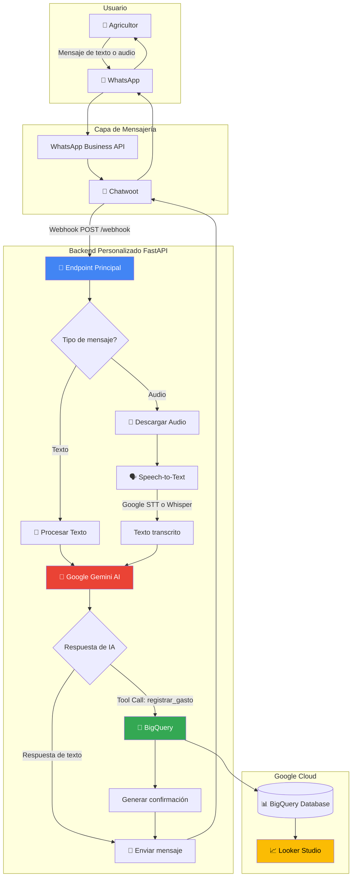
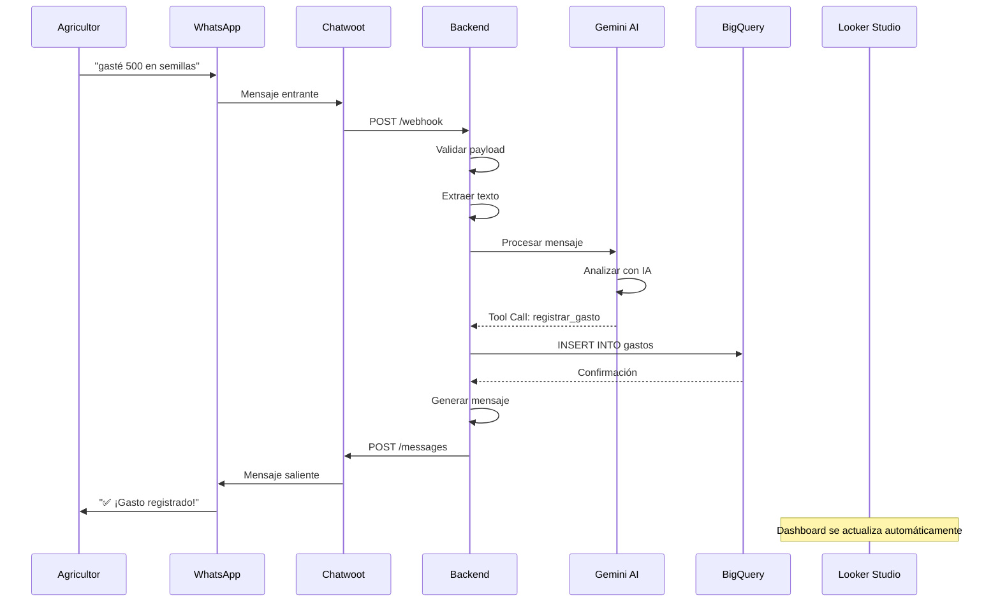
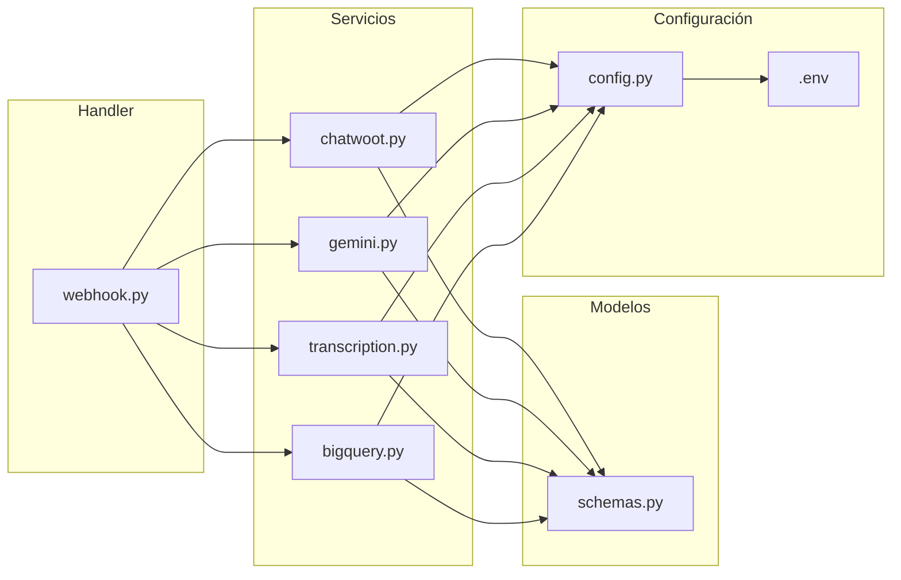
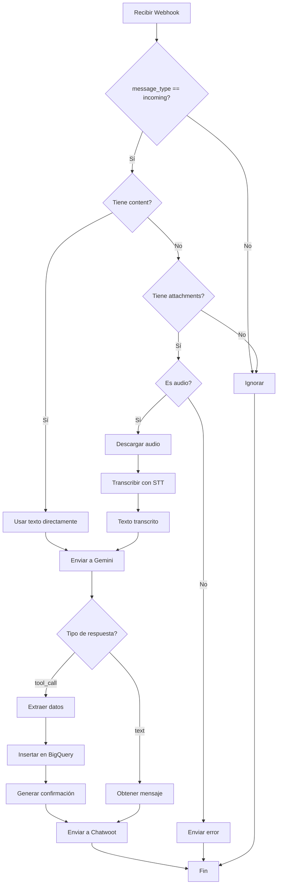
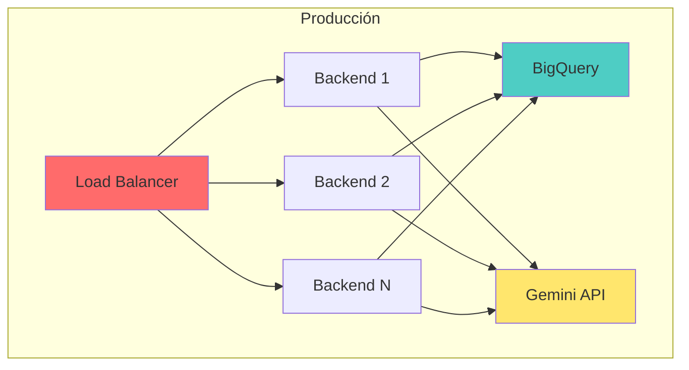

# 📐 Arquitectura del Sistema AgroAsistente

## Diagrama de Flujo Completo



## Diagrama de Secuencia - Flujo de Gasto



## Diagrama de Componentes



## Estructura de Datos

### Payload de Chatwoot (Entrada)
```json
{
  "event": "message_created",
  "account": {
    "id": 1
  },
  "conversation": {
    "id": 123
  },
  "message_type": "incoming",
  "content": "gasté 500 en semillas",
  "attachments": [
    {
      "id": 456,
      "file_type": "audio/ogg",
      "data_url": "https://..."
    }
  ],
  "sender": {
    "id": 789,
    "phone_number": "+521234567890"
  }
}
```

### Respuesta de Gemini (Tool Call)
```json
{
  "type": "tool_call",
  "data": {
    "monto": 500,
    "categoria": "Semillas 🌱",
    "descripcion": "semillas de jitomate"
  }
}
```

### Registro en BigQuery
```json
{
  "id_gasto": "550e8400-e29b-41d4-a716-446655440000",
  "id_usuario": "+521234567890",
  "fecha": "2025-01-15T10:30:00.000Z",
  "monto": 500.0,
  "categoria": "Semillas 🌱",
  "descripcion": "semillas de jitomate"
}
```

## Flujos de Decisión

### Procesamiento de Mensaje



## Tecnologías y Versiones

| Componente | Tecnología | Versión |
|------------|-----------|---------|
| Backend | Python | 3.11+ |
| Framework | FastAPI | 0.109.0 |
| IA | Google Gemini | 1.5 Flash |
| STT | Google Speech-to-Text | Latest |
| STT Alt | OpenAI Whisper | whisper-1 |
| Database | BigQuery | Latest |
| Dashboard | Looker Studio | Latest |
| Validación | Pydantic | 2.5.3 |

## Escalabilidad



## Seguridad

- ✅ Variables de entorno para secretos
- ✅ Validación de payloads con Pydantic
- ✅ Manejo de excepciones robusto
- ✅ HTTPS en producción
- ⚠️ Recomendado: HMAC signature verification
- ⚠️ Recomendado: Rate limiting

## Performance

- ⚡ Async/await para operaciones I/O
- ⚡ BigQuery streaming inserts
- ⚡ Procesamiento en memoria (no se guarda audio)
- ⚡ Múltiples workers en producción

---

**Última actualización**: Enero 2025
